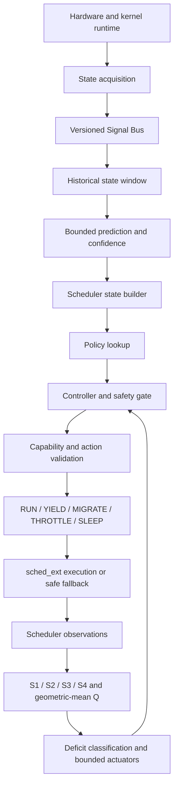

# ORCHESTRA-OS

ORCHESTRA-OS is a research-grade, capability-tiered Linux scheduling
prototype that coordinates observed runtime state, bounded prediction,
policy, controller gates, and sched_ext actions. The current product line is
`1.0.0-rc1`: source/build validation is established, while privileged
verifier, attachment, ownership, and hardware-runtime gates remain explicit
release conditions.

The safe default is observer/userspace operation. Kernel scheduling is
target-specific and is enabled only after the host capability check, a
target-matched BPF build, exact map/schema validation, and administrator
activation. When a capability, signal, policy, controller, or action check
fails, the scheduler preserves a bounded last-known-good/observed state and
falls back to `RUN` or conventional Linux scheduling.

## Architecture



The canonical decision path is one pipeline:

```text
read signal → read prediction → build state → policy lookup
→ controller gate → validate action → execute action → record result
```

The five actions are exactly `RUN`, `SLEEP`, `MIGRATE`, `THROTTLE`, and
`YIELD`. Action records retain requested, controller-adjusted,
capability-adjusted, actual, and fallback outcomes separately.

The corrected coordination index is:

```text
Q = (S1 × S2 × S3 × S4)^(1/4)
```

All four component scores and the aggregation window are required for a
valid Q report. Temporal stability (`S4`) is retained so synchronized mass
switching cannot appear healthy merely because actions agree at one instant.

## Product boundaries and capability tiers

| Tier | Behavior | Current evidence |
| --- | --- | --- |
| Observer | Portable userspace simulation, prediction/metrics contracts, diagnostics, and reports; no scheduling changes | Build, unit, integration, and source checks pass |
| Safe canary | Target-matched sched_ext object, exact map negotiation, explicit opt-in, bounded fallback, and loader-scoped cleanup | Kernel prototype source/build validated; live gate requires privilege and a compatible host |
| Certified kernel | sched_ext ownership, all action outcomes, RT bypass, watchdog/recovery, soak, and rollback evidence | Not claimed by this release candidate |
| Conventional fallback | CFS/EEVDF remains active whenever ORCHESTRA cannot safely own or decide | Implemented as the fail-closed boundary |

Current ABI contracts are additive and explicit: bridge ABI v2, kernel state
ABI v8, and native coordination/controller ABI v10, bundled by the product
ABI v1 header. The sched_ext BPF object is built against the target kernel's
BTF/UAPI and is not a universal binary. The stable source entry point is
`kernel/sched_ext/bpf/orchestra_sched.bpf.c`; the historical stage7 filename
is retained as the compatibility implementation body and output name.

## Quick start: observer and source validation

From the repository root:

```bash
./scripts/orchestra version
./scripts/orchestra check-system
make clean
make
make check
make test
./scripts/orchestra validate
```

The check is non-mutating by default. Use `./scripts/check-system.sh --json`
for machine-readable output. `--strict` is required before kernel activation
and fails unless the host passes the kernel capability gate.

Build userspace and the bridge into an external directory:

```bash
./scripts/build.sh --userspace --bridge
```

Build the target-matched scheduler only after the compatibility check passes
and an exact kernel source export is available:

```bash
ORCHESTRA_KERNEL_SRC=/lib/modules/"$(uname -r)"/build \
  ./scripts/build.sh --kernel
```

The builder records BTF, UAPI, helper-definition, compiler, source, and
artifact hashes in `ORCHESTRA_BUILD_DIR/build-manifest.txt`. It refuses a
kernel-version mismatch and never writes generated files into the source
tree.

## Install, enable, inspect, disable

The installer preserves existing configuration and never enables a scheduler
implicitly:

```bash
sudo ./scripts/install.sh
sudo /usr/local/bin/orchestra status
```

After a successful target-matched kernel build and an administrator-approved
runtime gate:

```bash
sudo /usr/local/bin/orchestra enable
sudo /usr/local/bin/orchestra status
sudo /usr/local/bin/orchestra telemetry
sudo /usr/local/bin/orchestra disable
sudo /usr/local/bin/orchestra uninstall --keep-config
```

`enable` performs a strict capability check, schema-checked loader attach,
and state verification. `disable` waits for the kernel to report
`disabled`; the loader removes only its own `/sys/fs/bpf/orchestra` pins.

## Policies and telemetry

Configuration examples are in [`config/examples`](config/examples), with
field/range documentation in [`config/README.md`](config/README.md). A
policy can be checked without touching maps:

```bash
./scripts/policy_load.py \
  --bridge /var/tmp/orchestra-os-build-"$(id -u)"/orchestra_bridge \
  --dry-run config/examples/adaptive.json
```

When kernel mode is active, publish and inspect it through the control plane:

```bash
sudo orchestra policy load /etc/orchestra-os/safe.json
sudo orchestra policy show
sudo orchestra controller status
sudo orchestra telemetry
```

## Documentation

- [Architecture](docs/architecture/ORCHESTRA_OS_ARCHITECTURE.md)
- [Installation](docs/installation/INSTALL.md)
- [Usage](docs/usage/USAGE.md)
- [Troubleshooting](docs/troubleshooting/TROUBLESHOOTING.md)
- [Developer guide](docs/development/DEVELOPMENT.md)
- [Research-to-code mapping](docs/research/RESEARCH_TO_CODE.md)
- [Final validation report](docs/validation/FINAL_VALIDATION_REPORT.md)
- [Final product status](FINAL_PRODUCT_STATUS.md)
- [Maintained diagrams](docs/diagrams/README.md)

## Research and claim discipline

The paper is the algorithmic authority for the pre-kernel simulation. Its
reported seed-42 and sensitivity values are not real-machine measurements.
The repository keeps historical experiments and VM evidence as archival
material; current claims are bounded by the evidence class recorded in
`FINAL_PRODUCT_STATUS.md` and the validation report. No universal speedup
over CFS/EEVDF is claimed.

## License

The product licensing notice is in [`LICENSE`](LICENSE). Kernel-facing files
carry their own GPL-2.0 SPDX notices, and inherited research/third-party
material retains its component license.
