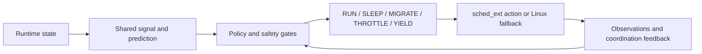

# ORCHESTRA-OS

Research software for **signal-coordinated process scheduling on Linux sched_ext**.
The architecture combines shared runtime signals, predictive state, adaptive
per-task actions, and coordination feedback. The submitted paper reports a
bounded kernel implementation and evaluation on one laptop; the earlier
architecture study used simulation.

[Paper and evidence](docs/paper/README.md) · [Reproduction](docs/paper/REPRODUCIBILITY.md) ·
[Latest release](https://github.com/Aether-0/ORCHESTRA-OS-final/releases/latest) ·
[Architecture](docs/architecture/ORCHESTRA_OS_ARCHITECTURE.md) · [Limitations](LIMITATIONS.md)

## Paper and results

**Signal-Coordinated Process Scheduling on Linux sched_ext: Design,
Implementation, and Bounded Evaluation of ORCHESTRA-OS** is submitted to
IEEE Access. Submission is not acceptance or publication. See the
[paper guide](docs/paper/README.md) for authors, available materials, and
citation boundaries.

The archived evidence supports a workload-specific foreground/background
trade-off, not general scheduler superiority:

| Archived observation | Result | Interpretation |
| --- | --- | --- |
| Foreground image workload, 20 counterbalanced pairs | Mean paired completion-time reduction 74.24% (95% paired t interval 72.72–75.76%) | Background CPU service fell 97.69%; a resource-control comparison remains unrun. |
| Pure CPU fixed work, 3 repetitions per mode | Completion-time ratios 1.58–2.05 relative to default Linux | Pure CPU throughput worsened. |
| Mixed CPU/I/O fixed work, 3 repetitions per mode | Completion-time ratios 0.86–0.94 | Small-sample directional observation. |

The [evidence map](docs/paper/EVIDENCE.md) links raw tables, negative results,
ownership gates, thermal confounding, action limitations, and the unexecuted
three-condition protocol. CSV label `cfs` denotes the historical default-Linux
baseline; on the recorded modern kernels this is the EEVDF scheduling path.

The [earlier Figshare dataset](https://doi.org/10.6084/m9.figshare.32925431.v1)
contains simulation materials. It is separate from the submitted hardware
paper and is not a verified DOI for the September hardware supplement.

## Architecture and scope



The five canonical actions are `RUN`, `SLEEP`, `MIGRATE`, `THROTTLE`, and
`YIELD`. The coordination aggregate is `Q = (S1 × S2 × S3 × S4)^(1/4)`;
all four components and the observation window are needed to interpret Q.
Temporal stability S4 is retained to detect synchronized switching.

| Layer | Evidence boundary |
| --- | --- |
| Userspace control and signal prototype | Portable build, unit, integration, and security regressions. Linux still performs scheduling. |
| Opt-in sched_ext prototype and bridge | Historical target-specific lifecycle, ownership, and action evidence; current privileged runtime gates remain separate. |
| Deployment, universal speedup, hard RT, distributed scheduling | Not established by this release. |

See [research-to-code mapping](docs/research/RESEARCH_TO_CODE.md) and
[current product status](docs/status/FINAL_PRODUCT_STATUS.md). Kernel maps use identity,
schema, and freshness gates; this is not a claim of kernel-side cryptographic
signal authentication. Userspace HMAC experiments are identified separately.

## Get the source

```bash
git clone https://github.com/Aether-0/ORCHESTRA-OS-final.git
cd ORCHESTRA-OS-final
```

For a fixed version, check out `v1.1.1`. The [latest release](https://github.com/Aether-0/ORCHESTRA-OS-final/releases/latest)
provides source ZIP/TAR.GZ and native packages for passing Linux targets,
`SHA256SUMS`, package SBOMs, build provenance, and platform results.
Verify selected downloads with `sha256sum --ignore-missing -c SHA256SUMS`
before extraction. GitHub provenance provides a separate authenticity check.
Version 1.1.1 simplifies documentation navigation and bundles detailed
build evidence and SPDX records. The 35-target native package pipeline is retained. Scheduler implementation and tests retain the reviewed
upstream revision `4c1fb8a`. Historical paper measurements belong
to their recorded artifacts, not automatically to this release.

## Choose a release download

For installation, choose the native package matching your distribution version
and CPU architecture. The release's `PLATFORM_RESULTS.md` lists actual passing
targets. Use your distribution's package manager to install or remove it.
Installation does not enable sched_ext.

Source ZIP/TAR archives are for building or reviewing the project.
`build-evidence.zip` contains detailed logs/results; `package-sboms.zip` contains
per-package SPDX records. Both include checksums for extracted contents.
See the [release guide](docs/releases/v1.1.1.md) for the download map.

## Validate without loading a scheduler

Requirements: Linux, a C compiler, make, and Python 3. Clang enables the
additional compiler checks. Run from a writable source tree:

```bash
./scripts/orchestra version
make
make check
make test
python3 scripts/check-doc-links.py
./scripts/check-system.sh --json
```

`make test` includes the static, unit, integration, and security gates. These
commands do not attach sched_ext. The [reproduction guide](docs/paper/REPRODUCIBILITY.md)
separates current-source validation, archived-data analysis, and exact
historical hardware replication. A passing build does not prove ownership
or effective action execution in the kernel.

Optional userspace/bridge build, into an external build directory:

```bash
./scripts/build.sh --userspace --bridge
```

The optional loader needs libbpf development headers. For target-matched
kernel build, installation, activation, telemetry, and scoped unload, use the
[installation](docs/installation/INSTALL.md) and [usage](docs/usage/USAGE.md)
guides. Native packages and GitHub build-provenance attestations accompany
the release. Kernel activation requires explicit administrator action.

## Repository layout

```text
ORCHESTRA-OS-final/
├── docs/                    Paper guide, evidence tables, architecture and operator guides
│   ├── paper/               Data dictionary, provenance, checksummed tables and protocol
│   ├── security/            Security model, threat model and hardening reports
│   ├── status/              Current software status and historical handoff links
│   ├── validation/          Dated software validation and hardening reports
│   └── history/             Earlier reports and checklists
├── orchestra_paper_cpu_demo/ Canonical userspace prototype
├── kernel/sched_ext/        BPF scheduler, ABI headers, bridge and loader source
├── userspace/               Control-plane overview
├── tests/                   Unit, integration and security regressions
├── benchmarks/              Existing hardware and publication benchmarks
├── experiments/             Versioned manifests and metric schemas
├── tools/                   Benchmark, plotting and evidence utilities
├── scripts/                 Build, capability, lifecycle and release tools
├── config/                  Example policies and service configuration
├── examples/                Documented usage examples
├── packaging/               Native package tooling and 35-target release CI
├── research/                Non-canonical exploratory prototypes
└── artifacts/               Historical measurements, logs and failure records
```

Start with the [documentation index](docs/README.md). Historical campaigns
are indexed in [artifacts/README.md](https://github.com/Aether-0/ORCHESTRA-OS-final/blob/v1.1.1/artifacts/README.md); their outcomes and
protocols apply to their recorded revisions. The copied Linux header tree
and generated host binaries are excluded from the current publication.
Their inventory and prior Git revision remain recorded for provenance.

## Citation and licensing

Use [CITATION.cff](CITATION.cff) to cite the software version used in your
work, and record the commit, kernel, build hashes, and experiment protocol.
The [paper guide](docs/paper/README.md) distinguishes the submitted manuscript
from the existing simulation dataset. No final article DOI is asserted.

Original userspace, tooling, and documentation are MIT-licensed; kernel-facing
files carry GPL-2.0 SPDX notices. Inherited components retain their licenses.
See [LICENSE](LICENSE), [NOTICE](NOTICE), and file-level SPDX notices.
For contributions and support, see [CONTRIBUTING.md](CONTRIBUTING.md),
[SUPPORT.md](SUPPORT.md), and the [security guide](docs/security/SECURITY.md).
