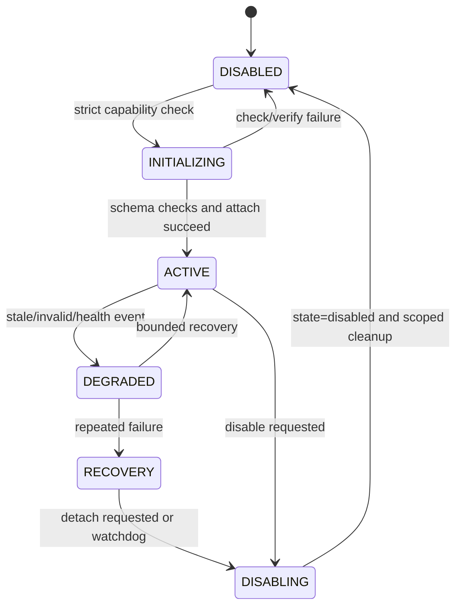

# ORCHESTRA-OS architecture

## Scope

ORCHESTRA-OS is a single-host Linux scheduler prototype with a portable
observer tier and an optional sched_ext backend. The product is intentionally
capability-tiered: a machine can use the signal, prediction, policy, metrics,
and diagnostics without changing scheduling, while a compatible privileged
host can attach the target-built sched_ext object.

The paper defines the research model. The kernel implementation is a bounded,
fixed-point realization of the model and reports its actual capabilities and
fallbacks. It does not claim universal sched_ext ABI compatibility or
universal performance improvement over CFS/EEVDF.

## End-to-end data flow


The maintained editable overview is also available as
[`docs/diagrams/overall.mmd`](../diagrams/overall.mmd).

## Component boundaries

### State acquisition and Signal Bus

The bridge and kernel maps carry fixed-width records with magic, ABI version,
schema/value size, generation, timestamps, and expiry. Signal publication is
generation-stamped and freshness-checked. A frame that is stale, invalid,
replayed, or schema-incompatible cannot drive an adaptive decision; the
runtime uses observed state or `RUN` fallback.

The current kernel-local transport is a validated BPF-map interface. It is not
a claim that the userspace HMAC signal protocol is cryptographically verified
inside BPF. Authentication/authorization beyond the implemented identity,
generation, freshness, and schema checks remains a separate security gate.

### Historical window and prediction

Runtime state is represented with bounded integer permille values. Prediction
records carry observed value, predicted value, confidence, model generation,
publication time, and expiry. The control path accepts a prediction only when
the record is structurally valid, current, and above the active confidence
and horizon thresholds. Otherwise it records a prediction fallback and uses
observed state.

The product boundary favors offline-calibrated model parameters. The current
kernel path consumes bounded prediction records; it is not an unbounded online
training service and does not assert convergence on real hardware.

### Scheduler state and policy

The v8 policy bank is two-bank and generation-published. Userspace fills the
inactive bank, validates each bounded entry, and commits the bank as one
generation. The kernel checks the active metadata, policy mode, controller
state, capability flags, state index, and action before making a decision.

The stable logical sequence is:

```text
orchestra_read_signal()
        ↓
orchestra_read_prediction()
        ↓
orchestra_build_state()
        ↓
orchestra_policy_lookup()
        ↓
orchestra_controller_gate()
        ↓
orchestra_validate_action()
        ↓
orchestra_execute_action()
        ↓
orchestra_record_result()
```

The sched_ext callbacks call this path and perform only event-specific queue
and dispatch work. The canonical implementation is
`kernel/sched_ext/bpf/orchestra_sched.bpf.c`. Historical source filenames
forward to it through compatibility wrappers; archived evidence keeps the
filenames and hashes originally recorded.

### Five-action model

| Action | Intended semantics | Safety/fallback rule |
| --- | --- | --- |
| `RUN` | Dispatch through the selected local/global DSQ using a bounded slice | Default fallback when any decision is invalid |
| `YIELD` | Relinquish the current opportunity and requeue under the bounded guard | Repeated-yield guard returns to `RUN` |
| `MIGRATE` | Select an eligible target CPU and use the sched_ext local-on path | Affinity, CPU-online, target, and capability failures fall back locally |
| `THROTTLE` | Defer eligibility under a bounded period/budget | Invalid or exhausted timing returns to a safe deferred/`RUN` path |
| `SLEEP` / `DEFER` | Defer eligibility until a bounded release deadline | Timer/map/generation failure releases the task to `RUN` |

Each result distinguishes requested, policy-selected, controller-adjusted,
capability-adjusted, dispatched, effective, and fallback action data. A
bridge request or counter increment alone is not evidence of effective
scheduling.

### Hybrid Safety Layer

The adaptive path has an explicit eligibility boundary. Protected real-time
classes (`SCHED_FIFO`, `SCHED_RR`, and `SCHED_DEADLINE`) must remain outside
adaptive ownership. The bridge rejects adaptive publication to protected
targets, and kernel ownership/admission checks are still required for any
runtime claim. The current research-stable release records this as implemented
source behavior, not as completed live RT coexistence validation.

### Coordination and Q

The native v10 coordination layer finalizes bounded windows for CPU, NUMA,
and global scopes. It records signal observations, policy/directive/action
relationships, state-conditioned action histograms, transition bursts,
oscillations, and fallback events.

The scores are fixed-point permille values:

```text
S1 = signal fidelity/freshness and prediction quality
S2 = directive/policy compliance on executed observations
S3 = state-conditioned action coherence
S4 = temporal stability, including transition and mass-switch penalties
Q  = (S1 × S2 × S3 × S4)^(1/4)
```

The geometric mean is computed with bounded integer square-root passes. A
valid report includes all four components, Q, window generation, window
interval, observation counts, excluded/protected tasks, and aggregation
formula. The index is not a throughput score and must not be invented for a
CFS run when the required ORCHESTRA observations are absent.

### Controller

The controller classifies deficits as `SIGNAL`, `COMPLIANCE`, `COHERENCE`,
`STABILITY`, or `MIXED`. A shared matrix maps each class to causally relevant
actuators. Every actuator has explicit minimum, maximum, default, maximum
step, generation, and saturation state.

The controller operates on two timescales: short coordination windows and a
slower rate-limited actuator update period. Hysteresis, minimum hold time,
cooldown, persistence, bounded steps, previous-known-good state, rollback,
and recovery prevent a noisy metric from causing unbounded oscillation.

### Lifecycle



The loader owns only `/sys/fs/bpf/orchestra` and its pinned link/maps. It
validates map name, type, key size, value size, and capacity before attach,
pins maps before struct_ops attach, and removes only its own pins during
unload.

## ABI and portability

The current product ABI bundle is defined in
`kernel/sched_ext/include/orchestra_product_abi.h`:

| Contract | Version | Role |
| --- | ---: | --- |
| Bridge | 2 | Existing userspace/map publication and telemetry records |
| Kernel state/policy | 8 | Bounded runtime, two-bank policy, task state, diagnostics |
| Native control | 10 | Coordination windows, Q, controller, actuators, runtime view |
| Product bundle | 1.0.0 | Release-level compatibility declaration |

Consumers validate magic, version, value size, schema, generation, and expiry.
Reserved fields are not reinterpreted. BPF artifacts are built against the
target kernel's BTF/UAPI and sched_ext API family. CO-RE-style layout
portability is useful, but it does not remove the need for target validation.

## Evidence boundary

The current implementation is `KERNEL_PROTOTYPED` and source/build validated.
The current host has sched_ext and BTF but lacks authorized non-interactive
root access and is not a dedicated kernel test machine; live verifier,
attach, ownership, all-action, RT, rollback, unload, and soak gates are
therefore documented as blocked rather than inferred.
