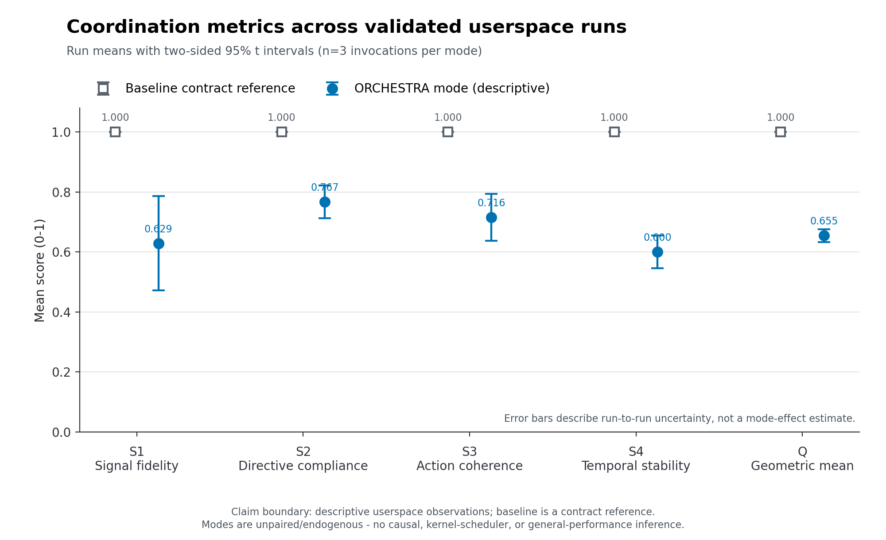
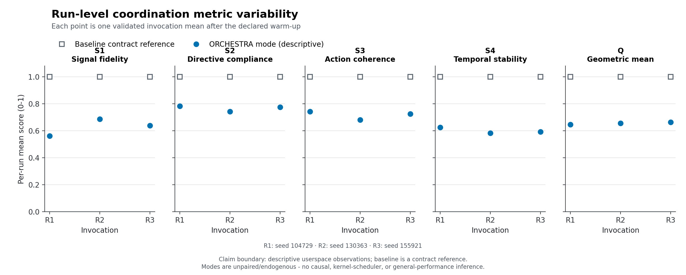
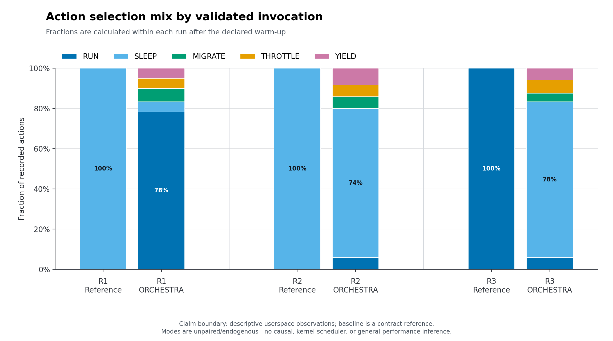
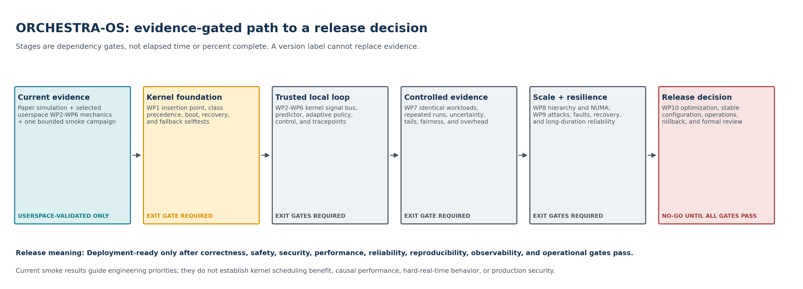

<!-- Markdown counterpart of the ORCHESTRA-OS release-readiness brief. -->

# ORCHESTRA-OS

## Research evidence and release-readiness plan

*Visual benchmark brief | Evidence-gated WP1-WP10 roadmap | 3 August 2026*

> Current claim class: USERSPACE-VALIDATED Selected userspace WP2-WP6 mechanics and a bounded six-run smoke campaign are available. Kernel-prototyped, Experimentally validated, and Deployment-ready claims are not supported.

## Decision in one sentence

Do not relabel the prototype as a release. Build and pass the kernel, trusted-loop, controlled-evidence, scale, resilience, and operational gates in dependency order; only then hold a formal deployment-readiness review.

# 1. Executive evidence snapshot

| Evidence item | Observed result | Interpretation boundary |
| --- | --- | --- |
| Campaign validity | 6/6 invocations valid; 3 independent runs per mode; 30 post-warm-up rows per run | Bounded smoke evidence, not general performance evidence |
| ORCHESTRA coordination | Q 0.655; S1 0.629; S2 0.767; S3 0.716; S4 0.600 | Descriptive run means with n=3; intervals remain wide |
| Prediction path | Prediction used for 95.6% of post-warm-up decisions on average | Calibration was not independently held out |
| Integrity and cadence | 0 rejected frames, 0 publisher deadline misses; 2 controller updates per ORCHESTRA run | Normal-path smoke only; not production security or reliability proof |
| Dispatch authority | Linux CFS/EEVDF remained in control | Userspace actions are approximations, not kernel action semantics |

## Run-level coordination summary

| Mode | S1 [95% CI] | S2 [95% CI] | S3 [95% CI] | S4 [95% CI] | Q [95% CI] |
| --- | --- | --- | --- | --- | --- |
| Observed-state reference | 1.000 [1.000, 1.000] | 1.000 [1.000, 1.000] | 1.000 [1.000, 1.000] | 1.000 [1.000, 1.000] | 1.000 [1.000, 1.000] |
| ORCHESTRA | 0.629 [0.472, 0.786] | 0.767 [0.712, 0.821] | 0.716 [0.638, 0.794] | 0.600 [0.545, 0.655] | 0.655 [0.633, 0.676] |

> Baseline interpretation The observed-state reference scores 1.0 by construction under this contract. The modes are unpaired and alter the endogenous host signal, so subtraction, speedup, treatment effect, and scheduler-superiority claims are not valid.

# 2. Visual benchmark results

*Figure 1. Coordination metric means and 95% Student-t intervals across three independent runs per mode. The reference is a contract check, not a causal comparator.*

*Figure 2. Per-run S1-S4 and Q values. Points expose run-to-run variability that a single aggregate would hide.*

*Figure 3. Canonical action mix by run. RUN, SLEEP, MIGRATE, THROTTLE, and YIELD remain userspace approximations here.*

# 3. Evidence-gated path to release

*Figure 4. Dependency path from current userspace evidence through WP1-WP10. Boxes are gates, not a schedule or percent-complete estimate.*

- Status: Proposed evidence-gated operations plan

- Date: 2026-08-03

- Scope: Research artifacts, kernel prototypes, experiments, scale-out work, and any future deployment-readiness review

- Governing source: repository AGENTS.md, including the WP1-WP10 dependency order and exit gates

## Readiness decision today

The highest maturity class supported by current repository evidence is Userspace-validated. That classification applies only to the bounded, single-host userspace mechanisms that were actually exercised. It does not promote the whole architecture, or any untested mechanism, to that class.

| Claim class | Current decision | Evidence boundary |
| --- | --- | --- |
| Userspace-validated | **Supported, with bounded scope** | Real processes, real host observations, focused unit/integration tests, and the six-run `paper_cpu_smoke_v1` campaign exercise selected userspace WP2-WP6 precursor mechanics. |
| Kernel-prototyped | **Not supported** | There is no bootable test kernel, approved scheduling-extension implementation, kernel scheduler hook, Kconfig integration, or kernel selftest evidence. |
| Experimentally validated | **Not supported** | The current smoke is explicitly descriptive, unpaired, endogenous, and run on an active desktop with `n = 3` invocations per mode. It was not designed to estimate a causal treatment effect or scheduler improvement. |
| Deployment-ready | **Not supported** | WP1-WP10 exit gates, production key lifecycle, kernel recovery, controlled performance evidence, scale tests, threat validation, soak testing, and a formal readiness review have not been completed. |

The current evidence base includes:

- the userspace state, reward, metric, and controller contract in

ADR 0001 (../adr/0001-userspace-state-metric-controller-contract.md);

- the single-host canonical frame and verification contract in

ADR 0002 (../adr/0002-userspace-signal-frame-contract.md);

- strict compiler, sanitizer, unit, and bounded integration checks reported by the current smoke result; and

- the versioned smoke protocol (../experiments/paper_cpu_smoke_v1.md) and

2026-08-03 result (../experiments/paper_cpu_smoke_v1_result_2026-08-03.md).

That result reports six successful short invocations and useful contract-level telemetry. It also records confounding, an active non-isolated host, no real-time workers, no kernel dispatch, and missing latency, fairness, energy, scale, fault-recovery, and long-duration evidence. A byte-identical local copy now exists under artifacts/test-results/2026-08-03/ with an inventory and checksum manifest. Approved long-term storage, repository revision identity, retention, and retrieval policy remain unresolved. These limitations are release inputs, not footnotes to waive.

There is also a canonical-scope hygiene blocker. The legacy orchestra_real_cpu_demo/ implements process groups, group runnable budgets, and coordinator-driven restart behavior that the approved research scope explicitly excludes from the canonical architecture. Before even a U0 research snapshot is packaged, this artifact must either be moved under research/experiments/ with an Exploratory claim, explicit hypothesis, and separate documentation, or be excluded from the release manifest. It must not be built, measured, or described as part of canonical ORCHESTRA-OS.

Evidence hygiene also applies to the browser demo. orchestra_os_demo.html describes rotating-key HMAC behavior, but its integrity routine is an illustrative random tamper/block model rather than a cryptographic implementation. It may remain only as clearly labeled simulation/illustration and must not be cited as authentication, key-rotation, tamper-detection, or production-security evidence. A release inventory must classify or exclude every top-level executable/demo; the current root Makefile tests only the paper CPU demo and is not a complete release inventory.

## Meaning of a release

A release is an immutable, reproducible research artifact with an explicit claim class. A version number, passing build, demo, or short benchmark does not by itself change maturity. Each release record must state:

1. exactly which artifact and commit or content hashes were evaluated;

1. the strongest permitted claim class and its scope;

1. every applicable gate as passed, failed, not run, or not applicable;

1. failures, exclusions, exceptions, and approved risk decisions;

1. links or checksums for manifests, raw data, processed data, and reports;

1. the environment and configuration needed to reproduce the result; and

1. the tested rollback path and the evidence that it restored safe operation.

Research snapshots may be released while later gates remain open, but their names and release notes must say so. A research snapshot must not be presented as a production candidate.

## Dependency and status map

No downstream claim may bypass its upstream evidence gate. Work may proceed in parallel, but a later work package remains blocked for release purposes until its dependencies pass.

The boxes are dependency gates, not elapsed time or percent complete.

## Proposed release stages

Stage names describe review checkpoints, not schedules. No calendar estimate is implied.

| Stage | Work-package scope | Go evidence | Permitted claim after approval | Required rollback before approval |
| --- | --- | --- | --- | --- |
| U0 - bounded userspace research snapshot | Existing simulator/userspace precursors | Reproducible build and tests; immutable smoke inputs and retained raw artifacts; limitations disclosed | Userspace-validated only for named, tested mechanisms and environments | Bounded process termination, child/shared-resource cleanup, and artifact preservation |
| K0 - kernel foundation candidate | WP1 | Bootable test kernel or approved extensible-scheduler implementation; conventional and real-time fallback regression tests; documented interfaces; automated build, boot, and recovery | Kernel-prototyped only for the WP1 mechanisms actually exercised | Known-good boot entry, runtime disable/detach where supported, and tested conventional-scheduler recovery |
| K1 - trusted local scheduling substrate | WP2-WP3 after WP1 | Coherent kernel signal publication, rejection and recovery tests, key lifecycle design, measured verification budget, held-out predictor calibration, confidence fallback, and stale-prediction exclusion | Kernel-prototyped local signal/predictor path; no adaptive-performance or production-security claim | Disable signal/prediction path; reject incompatible schemas; return to observed-state and then conventional scheduling |
| K2 - bounded adaptive kernel prototype | WP4-WP6 after WP1-WP3 | Exact kernel action contracts, Hybrid Safety Layer, real-time/exempt bypass, bounded authority, S1-S4/controller tests, saturation response, selective tracing, and measured instrumentation overhead | Kernel-prototyped adaptive path under declared test conditions | Per-task removal, global adaptive disable, policy reset, safe scheduler fallback, and known-good boot |
| E0 - experimental validation candidate | WP7 after WP1-WP6 | Predeclared controlled experiments, identical workload/hardware conditions for baselines, sufficient repetitions, uncertainty, complete failure reporting, and traceable raw-to-report lineage | Experimentally validated only for the preregistered questions, workloads, hardware, and confidence bounds that pass | Preserve previous candidate; stop on validity breach; rerun only under a new immutable manifest |
| S0 - scale and assurance candidate | WP8-WP9 after WP7 | Multi-level failure isolation, measured communication/NUMA costs, documented consistency, current threat model, attack/fault campaigns, recovery distributions, and long-duration reliability evidence | Experimentally validated at the tested scale and assurance envelope; still not deployment-ready | Higher-tier isolation with safe local continuity, key revocation/recovery, fault containment, and tested downgrade |
| R0 - deployment-readiness candidate | WP10 after WP9 | Stable defaults, sustained-run criteria, bounded optimization, operational documentation, complete configuration/rollback evidence, no unresolved critical vulnerability without explicit risk decision, and formal review | Deployment-ready only after the formal review grants that class and records its exact envelope | Operational rollback rehearsal, compatible data/schema handling, known-good software/kernel image, and post-rollback verification |

If a stage changes a public protocol, scheduler precedence, action semantics, state schema, reward, compliance rule, metric, controller, fallback, predictor, or key lifecycle, an approved ADR and migration/reset plan are entry requirements.

## WP1-WP10 evidence ledger

“Precursor evidence” means useful userspace research input. It does not satisfy a kernel or downstream exit gate.

| WP | Dependency | Evidence present now | Evidence still required to pass the exit gate | Release status |
| --- | --- | --- | --- | --- |
| WP1 - Linux Kernel Integration | Simulation/userspace evidence | Userspace action approximations and Linux-host measurements | Approved insertion point and precedence ADR; kernel or approved extension implementation; task/run-queue interfaces; boot/build/debug/recovery automation; conventional, deadline, and real-time fallback regressions; kernel smoke tests | **Not started for gate purposes; not passed** |
| WP2 - Signal Bus | WP1 | Userspace 128-byte payload, HMAC verification, coherent single-writer snapshots, freshness/sequence checks, tamper tests, and bounded last-known-good behavior; schema 1 lacks the required prediction-horizon field | Kernel-safe fixed-point/frame design with prediction horizon; core/socket/NUMA/system hierarchy; complete concurrency and lifetime proof; explicit duplicate rejection/diagnostics; key provisioning/rotation/revocation/recovery; live epoch-transition and rotation-race tests; parser fuzzing; contention and recovery tests; publication/verification mean and tail budget | **Userspace precursor only; not passed** |
| WP3 - Predictive Engine | WP2 | Lightweight userspace estimator, confidence field, observed-state fallback, and forecast telemetry | Independent held-out calibration/evaluation; versioned parameter artifact; workload/hardware metadata; no-look-ahead proof; recalibration triggers; degraded/negative cases; mean/tail latency, CPU, memory, and cache budget in the intended scheduler path | **Userspace precursor only; not passed** |
| WP4 - Adaptive Scheduling | WP3 | State schema v2, canonical five-action selection, bounded reward terms, annealed exploration, consensus precursor, and userspace real-process execution | Kernel contracts for RUN/SLEEP/MIGRATE/THROTTLE/YIELD; admission and removal; safety-class precedence; syscall/dispatch outcome evidence; starvation/fairness controls; conventional fallback; bounded safe exploration; stress evidence without uncontrolled oscillation | **Userspace precursor only; not passed** |
| WP5 - Measurement and Control | WP4 | Bounded S1-S4 and zero-preserving geometric-mean Q; thundering-herd test; 20-tick, decaying, causally mapped userspace controller | Per-level metrics; versioned compliance rule; longer-window/stability analysis; sustained-saturation alert; controller disable, rollback, and re-entry; convergence and oscillation tests; kernel actuator effects; false-good tests across integrated behavior | **Userspace precursor only; not passed** |
| WP6 - Instrumentation | WP5, with instrumentation developed alongside prior packages | Machine-readable userspace CSV for predictions, actions, S1-S4, Q, controller state, rejections, fallbacks, and missed deadlines | Selective kernel tracepoints for final dispatch and all actions; reason-specific verifier/fallback/controller events; coherent timestamps; schema metadata; dropped-event accounting; mean/tail tracing overhead and perturbation evidence | **Partial userspace observability only; not passed** |
| WP7 - Experimental Evaluation | WP6 and stable WP1-WP5 semantics | Versioned bounded smoke manifest, schema validator, three runs per mode, uncertainty summaries, hashes, and disclosed failures/limitations | Isolated and pinned host; counterbalanced/randomized order; identical replayable workload across baselines; independent calibration data; predeclared primary outcomes and power/repetition rationale; latency, fairness, energy, throughput, overhead, and robustness; Linux baseline under identical conditions; confirmatory analysis | **Smoke evidence only; not passed** |
| WP8 - Scalability and Multi-Level Coordination | WP7 | No qualifying implementation; only a fixed core-local tier identity | Explicit core/socket/NUMA/node/cluster responsibilities and conflicts; distributed ordering/clock/consistency design; local continuity under higher-tier loss; scale tests; communication and remote-memory costs; bottleneck and limit report | **Not started for gate purposes; not passed** |
| WP9 - Security, Reliability, and Resilience | WP8 | Focused userspace HMAC/tamper/freshness tests and bounded fallback precursor | Current threat model and trust boundaries; production key lifecycle; spoof/replay/corruption/authorization campaigns; combined attack/fault injection; recovery-time distributions; long-duration leak/instability tests; security monitoring; explicit critical-risk decisions | **Focused precursor tests only; not passed** |
| WP10 - Optimization and Deployment Readiness | WP9 | No qualifying integrated evidence | Profile-led optimization without semantic/security regression; stable defaults; sustained-run acceptance; configuration and rollback documentation; operator diagnostics; end-to-end regression; explicit limitations; formal readiness decision | **Blocked by WP1-WP9; not passed** |

## What the controller may control

Control changes must follow diagnosed submetrics and causal evidence. Aggregate Q is an outcome and alarm signal; it is not sufficient diagnosis for choosing an actuator.

| Observed deficit | Permitted control path | Required guard/evidence | Disallowed shortcut |
| --- | --- | --- | --- |
| S1 signal fidelity/freshness | Reject invalid/stale data; use bounded last-known-good data; fall back to observed state; adjust prediction horizon/gain only when forecast quality is the diagnosed cause; adjust sampling only when freshness/overhead analysis supports it | Confidence, age, verification result, prediction error after observation, deadline and cost telemetry | Retuning prediction because S3/S4 or aggregate Q is low |
| S2 directive compliance | First diagnose eligibility, exemptions, directive/reward/state consistency, exploration, action failure, and final dispatch; any learning-authority change requires a bounded, versioned policy experiment | Versioned compliance rule; selected-versus-effective action; reward components; safety overrides; fairness and responsiveness | Raising agreement by overriding safety classes, hiding exemptions/failures, or making exploration unbounded |
| S3 action coherence | Bounded, infrequent compatible-policy consensus and a bounded switching penalty | Schema compatibility, participant/timeout telemetry, homogenization and correlated-failure tests, performance/fairness checks | Treating uniform action as inherently good or performing exact counterfactual work in a kernel hot path |
| S4 temporal stability | Perceptual jitter derived from robust observation-noise estimates and a bounded switching penalty | Switching bursts, migration bursts, latency, fairness, responsiveness, and run-to-run variance; controller rate slower than learner | Maximizing stability by making processes ignore legitimate signal changes |
| Latency, fairness, energy, or overhead regression | Diagnose the responsible scheduler/action/instrumentation path and use its specifically approved bounded control | Separate service-level telemetry and predeclared limits | Optimizing Q as a proxy for these independent outcomes |

Every automatic actuator must have a minimum, maximum, rate limit, update cadence, saturation counter, alert, rollback/disable condition, re-entry rule, and telemetry for requested and applied values. Outer-loop updates must remain slower than inner learning. Reward logic, state boundaries, directive logic, compliance scoring, tests, documentation, and experiment version must change together.

The current controller is a userspace precursor: it updates every 20 ticks with a decaying step and fixed bounds, but it consumes an instantaneous eligible snapshot and lacks sustained-saturation counters, alerting, rollback, and disable/re-entry state. Those are explicit K2/WP5 blockers.

## Benchmark evidence ladder

Benchmarking advances a claim only when the design can answer the declared question. Thresholds must be defined in an approved protocol or manifest before data collection; they must not be selected after seeing results.

| Level | Question | Minimum controls and outputs | Stop/go interpretation |
| --- | --- | --- | --- |
| B0 - contract smoke | Does the artifact run and preserve local invariants? | Fixed inputs, schema validation, bounded duration, raw output, errors, hashes, sanitizer/unit/integration tests | Current campaign supports this level only. Failures stop the artifact release; success does not imply performance improvement. |
| B1 - controlled userspace characterization | What costs and behaviors arise from the userspace mechanisms on declared hardware/workloads? | Isolated/pinned host; fixed frequency policy; randomized or counterbalanced order; identical workload replay; held-out calibration; repetitions justified before the run; latency, throughput, fairness, CPU, memory, energy, prediction, S1-S4/Q, fallback, and instrumentation overhead | Go only for scoped userspace characterization. Do not infer kernel scheduling effects. |
| B2 - kernel functional and safety validation | Do kernel semantics, precedence, and fallbacks match their contracts? | Kernel selftests and stress tests; all five effective action outcomes; deadline/RT/exempt bypass; starvation checks; invalid/stale signal cases; boot and runtime rollback; crash/hang capture | Any precedence, safety, liveness, or recovery failure stops kernel-candidate promotion. |
| B3 - kernel comparative evaluation | Does the integrated prototype improve predeclared outcomes without unacceptable regressions? | Same kernel base, hardware state, workload traces, affinity, warm-up, and instrumentation across Linux baselines and ORCHESTRA; randomized order; sufficient independent runs; tail distributions and uncertainty; failed-run accounting | Promote only the preregistered claims that meet their predeclared criteria. A Q improvement cannot compensate for a breached safety, tail-latency, fairness, or overhead limit. |
| B4 - scale, fault, and adversarial validation | Where does coordination remain safe and useful under topology, delay, loss, fault, and attack? | Multi-core/NUMA/node scale matrix; communication and remote-memory costs; clock/order cases; partitions; tamper/replay/spoof/key events; combined faults; recovery distributions | Any unsafe loss of local continuity, trust bypass, or unbounded controller behavior stops scale/assurance promotion. |
| B5 - sustained readiness validation | Can the approved configuration operate, degrade, recover, and roll back for the declared service envelope? | Long-duration workload mix; memory/resource leak checks; repeated failure/recovery; operational alarms; upgrade/downgrade; rollback rehearsal; full provenance | Evidence feeds WP10 formal review. It cannot self-grant Deployment-ready status. |

For every benchmark, the invocation - not a tick or worker row - is the default independent statistical unit unless the protocol justifies another model. Report warm-up, missing data, exclusions, timeouts, crashes, unsuccessful privilege changes, and all failed runs. Keep raw data immutable and perform validation and processing in separate, versioned steps.

## Universal go and stop criteria

### Go criteria

A candidate may enter its next stage only when all of the following are true:

- every upstream exit gate is recorded as passed against immutable evidence;

- the candidate's interfaces and semantics are frozen or changed through an approved ADR with compatibility and migration handling;

- functionality, safety, security, reliability, observability, performance, and reproducibility evidence covers the declared envelope;

- all predeclared tests ran, and failures and exclusions are included in the decision record;

- rollback was exercised from the exact candidate configuration;

- raw artifacts and their checksums are retained under the artifact policy;

- open limitations are consistent with the proposed claim class; and

- the applicable review explicitly approves the scoped promotion.

### Immediate stop criteria

Stop promotion, preserve evidence, and diagnose before rerunning when any of the following occurs:

- a proposed claim is stronger than its evidence class;

- a release inventory omits an executable, demo, test surface, generated artifact, or explicitly excluded exploratory component;

- an upstream gate is missing, failed, or has unreviewed incompatible changes;

- the artifact, manifest, schema, environment, or raw-data identity cannot be established;

- raw data were overwritten, silently filtered, or cannot be traced to the processed result;

- a hard-real-time, deadline, exempt, or conventional task bypasses its required precedence or fallback contract;

- a torn, stale, replayed, malformed, wrong-source, or unauthenticated frame is accepted for a new adaptive decision;

- a stale or low-confidence prediction affects a decision outside its approved fallback policy;

- S1-S4 or Q becomes non-finite/out of range, exact-zero collapse is lost, or a thundering herd receives a false-good stability score;

- an actuator exceeds its bounds/rate, oscillates without containment, remains saturated without an alert, or lacks a tested rollback;

- a kernel panic, hang, data corruption, starvation event, uncontrolled migration/throttle burst, or unrecoverable scheduler failure occurs;

- an unresolved critical vulnerability lacks an explicit recorded risk decision;

- instrumentation loss or perturbation makes the declared conclusion invalid; or

- a predeclared safety, tail-latency, fairness, overhead, recovery, or stability limit is breached.

A stop is an experimental outcome. It must remain in the run ledger and must not be converted into an exclusion merely to improve the reported result.

## Security and reliability requirements

Before WP9 can pass, the program must have an approved threat model covering producer, consumer, key holder, control plane, instrumentation, storage, and core/node/cluster trust boundaries. The inherited userspace master key is test scaffolding, not a production root of trust.

Required evidence includes:

- generation, provisioning, per-tier derivation, rotation overlap, revocation, node join/leave, compromise recovery, audit, and secret-erasure behavior;

- bounds/schema/identity/sequence/freshness/authentication verification in the required order, constant-time tag comparison, and parser/verifier fuzzing;

- tamper, replay, duplicate, stale, wrong-source, unauthorized modification, sequence/epoch boundary, partial-publication, and key-transition tests;

- communication, publisher, reader, predictor, policy, controller, storage, and clock fault injection, including combined attack-plus-fault cases;

- safe local continuity when prediction, signal service, controller, or a higher hierarchy tier fails;

- mean and tail detection/recovery time, availability impact, data loss, and re-entry behavior; and

- long-duration evidence for leaks, counter/epoch handling, progressive instability, livelock, starvation, and unbounded adaptation.

Detected integrity failures must fail closed for the adaptive input while scheduling fails operationally safe: bounded last-known-good use, observed-state fallback where valid, conventional Linux scheduling when coordination is unsafe, and explicit recovery/re-entry conditions.

## Rollback and recovery requirements

Rollback is part of the feature, not an operator assumption.

- Userspace: terminate within a bounded watchdog window; reap children; release mappings, descriptors, affinity changes, and other resources; retain stdout/stderr and partial artifacts with a failure record.

- Kernel: provide a known-good boot selection and documented recovery console; support a tested build-time exclusion and, where the implementation permits it, a runtime global disable or scheduling-extension detach; preserve conventional and real-time scheduling precedence during failure.

- Task/policy: remove eligibility safely, stop new adaptive decisions, complete or cancel in-flight transitions coherently, and reset or migrate versioned policy state without interpreting incompatible tables.

- Signal/predictor/controller: reject incompatible schemas, expire unsafe data, disable the affected component, bound last-known-good use, and verify observed-state/conventional fallback before re-entry.

- Hierarchy: isolate a failed or untrusted higher tier and maintain safe node/core-local scheduling; reconnect only under explicit identity, ordering, freshness, and state-reconciliation rules.

- Release: preserve the previous signed/hashed artifact and configuration; exercise upgrade, downgrade, and data/schema compatibility; verify health and scheduler policy after rollback.

Rollback tests must cover failure during activation, steady operation, schema or key transition, and recovery. A procedure that has only been documented but not successfully exercised does not satisfy a go gate.

## Observability requirements

The existing CSV is useful userspace evidence, but release candidates require selective, versioned instrumentation that records what the system actually did, not only what a policy selected. The applicable stage must expose:

- observation, prediction, confidence, age, horizon, error when knowable, and observed-state fallback;

- frame schema, tier/source, sequence/epoch, acceptance/rejection reason, coherent-read retry/exhaustion, verification latency, and last-known-good age;

- eligibility/exemption, requested action, safety override, effective kernel action/dispatch outcome, migration target/result, throttle duration, sleep, yield, wake, preemption, and action failures;

- per-process/core/node/system S1-S4 and Q with metric/compliance schema versions;

- controller input window, skip reason, step/cadence, requested/applied actuator, bounds, rate limiting, saturation streak, alert, rollback, and re-entry;

- fairness, starvation, run-queue, latency, throughput, CPU, memory, cache, energy/thermal, network/I/O where relevant, and deadline-miss measures; and

- failure, recovery, dropped-event, clock-domain, environment, and artifact provenance fields.

Trace collection must be selectively enabled. Timestamp comparability and clock scope must be declared, dropped records must be visible, output must carry its schema and metadata, and tracing's mean/tail CPU, memory, cache, and latency perturbation must be measured. If instrumentation changes the behavior beyond a predeclared bound, the affected benchmark cannot support a go decision.

## Reproducibility and artifact requirements

Every release-qualifying campaign must retain:

- repository revision and dirty state, or content hashes when Git metadata is unavailable;

- compiler/toolchain, dependencies, build command, flags, kernel source/config, firmware/microcode, and binary/module hashes;

- hardware topology, NUMA layout, memory, storage, network, clock source, virtualization/container state, power/frequency/turbo/thermal policy, privilege/capabilities, affinity, background-load controls, and time zone;

- immutable experiment manifest, workload/input hashes, seeds, calibration artifact and split, schema versions, baseline order, warm-up, timeout, and repetition rationale;

- per-invocation status, stdout/stderr, raw traces, validation results, exclusion reasons, processed outputs, analysis configuration/code, and report; and

- checksums and lineage linking every report value to raw evidence.

Raw data must never be mutated. Large artifacts may live outside the repository under the approved artifact policy, but the repository must retain durable identifiers, checksums, schema, retrieval instructions, and retention status. Temporary paths alone are insufficient for a release gate. A rerun after code, manifest, environment, or analysis changes is a new campaign, not a replacement for the earlier record.

## Formal review record

The review record for each stage must include:

1. proposed stage and exact claim envelope;

1. WP gate checklist and links/checksums for each item of evidence;

1. benchmark questions, predeclared criteria, results, uncertainty, failures, exclusions, and negative findings;

1. security, reliability, observability, and rollback assessments;

1. open defects and limitations, with explicit risk decisions where permitted;

1. compatibility, policy reset/migration, and operational recovery decisions;

1. reviewer roles and the approve, reject, or return-for-evidence decision; and

1. the stronger claims that remain prohibited after the decision.

Only the formal WP10 review may grant Deployment-ready, and only for the configuration and operating envelope named in that record.

## Next execution tranche

This is the shortest evidence-preserving route to the first kernel candidate. Items are ordered by dependency, not duration.

| Order | Deliverable | Completion evidence | Dependency |
| --- | --- | --- | --- |
| 1 | Freeze the release surface and claim ledger | Root release inventory classifies every source, binary, historical artifact, and demo; the noncanonical group demo is isolated/excluded; the browser demo is labeled non-cryptographic; root README, license, security, contribution, artifact-retention, and support policies exist | None |
| 2 | Establish immutable provenance | Version-control identity, reproducible toolchain/build recipe, clean release manifest, source-to-binary attestation, and approved long-term storage/retrieval policy building on the retained local checksums | Order 1 |
| 3 | Approve the WP1 kernel design | ADR selects native versus extensible scheduler insertion, class precedence, task/run-queue state, locking/lifetime rules, action/fallback contracts, debug strategy, and known-good boot recovery | Orders 1-2; simulation/userspace evidence |
| 4 | Build the recoverable K0 foundation | Automated kernel/extension build, disposable boot target, attach/detach or disable path where applicable, conventional/deadline/RT regression suite, kernel smoke tests, and exercised rollback | Order 3 |
| 5 | Approve the WP2 trust and frame revision | Threat model plus schema ADR adds prediction horizon and explicit duplicate/replay/wrap behavior; defines key ownership/lifecycle, coherent-read retry diagnostics, hierarchy interfaces, and hot-path budgets | Order 4; design work may start earlier but cannot pass first |
| 6 | Implement and stress the local kernel signal substrate | Parser/verifier fuzzing, high-contention publication/read tests, epoch transition and rotation-race tests, publisher-loss recovery, no torn accepted frames, and measured p50/p95/p99/max cost | Order 5 |
| 7 | Freeze the WP3 evaluation split and model artifact | Immutable held-out traces, versioned parameters, confidence calibration, degraded/OOD cases, negative-Kalman regression, and scheduler-budget measurements | Order 6 |
| 8 | Enter K1 review | WP1-WP3 ledgers complete, fallbacks and rollback exercised, all failures retained, and formal review approves only the tested kernel signal/predictor envelope | Orders 1-7 |

WP4-WP10 implementation follows only after these upstream contracts are stable. Performance tuning may be prototyped for cost discovery, but no optimization result may bypass semantic, safety, or validity gates.

## Open uncertainties that block stronger claims

The roadmap deliberately does not guess answers to these unresolved decisions:

- the approved Linux scheduler insertion point, class precedence, and whether an extensible scheduling framework or a native class will satisfy WP1;

- kernel-safe frame encoding, synchronization/lifetime model, hierarchy layout, and publication/verification budgets;

- root of trust, provisioning authority, node identity, rotation overlap, revocation, and compromise-recovery model;

- independent calibration dataset, target workload families, prediction budget, confidence calibration, and recalibration trigger;

- exact kernel semantics and safety limits for all five canonical actions;

- the versioned S2 compliance rule when safety overrides or action failures occur, and the approved approximation for difference rewards in kernel paths;

- controller input-window design, saturation duration, alarm thresholds, rollback/re-entry policy, and quantitative stability criteria;

- primary experimental outcomes, smallest relevant effects, power/repetition rationale, baseline set, and acceptance limits for latency, fairness, energy, overhead, recovery, and stability;

- target hardware/topology and the distributed clock, consistency, conflict, and partition model for WP8;

- approved long-term artifact storage, retention, access, and retrieval policy; the current smoke now has a checksummed local copy but no approved durable external store or repository revision identity; and

- deployment environment, support model, sustained-run duration, and formal review authority.

Resolve each architecture-level uncertainty through the required ADR or versioned experiment protocol before using it as a release criterion. This plan contains no calendar estimates because the evidence gates, not elapsed time, determine readiness.

# 4. Evidence identity and document limits

| Artifact | SHA-256 |
| --- | --- |
| C source | d5ec68c28a2cfcc20475dba44cb4b3c36b46b08acb4206647b874d2e2edf8713 |
| Benchmark binary | f2f14020ef6f4caf7cc1f9dda3b392451367209b9d9f79e27415680c5e678b4b |
| Benchmark harness | 3c07263066118a7f08c9e10ae80c488bb8fae680db08b31cba6b7154aec193d6 |
| Manifest | 40844535648f4a7dc25131141035d9cfb88886c20f0f8b9fb4bbbc8ffef02b5a |
| Metrics schema | 04cb97e55d66bcf3e03e810372865c25368c89abb5de4e09e43d952d6f2d09c2 |

> Document limit This brief is a planning and evidence-communication artifact. It does not approve a release, replace an ADR, satisfy a work-package exit gate, or strengthen the underlying research claim.
